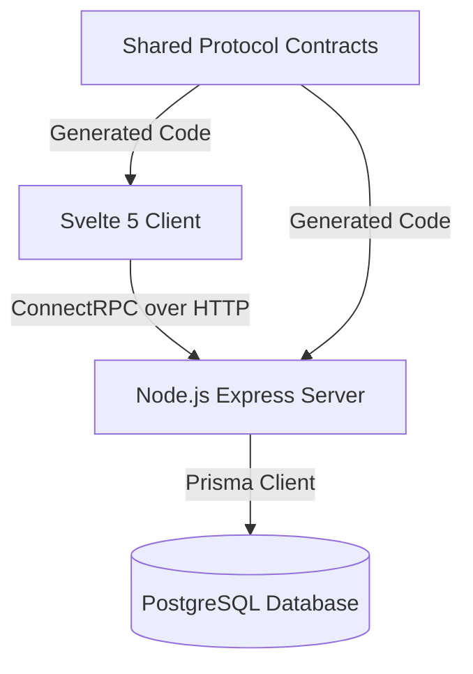
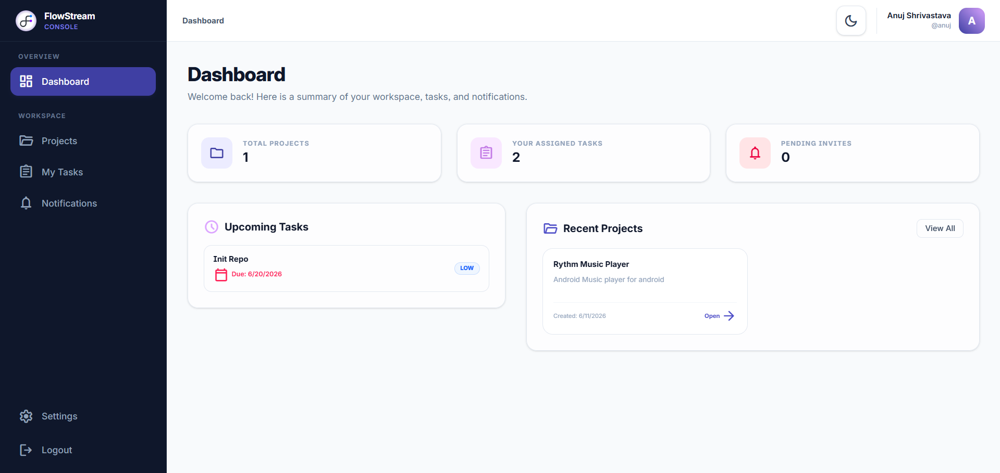
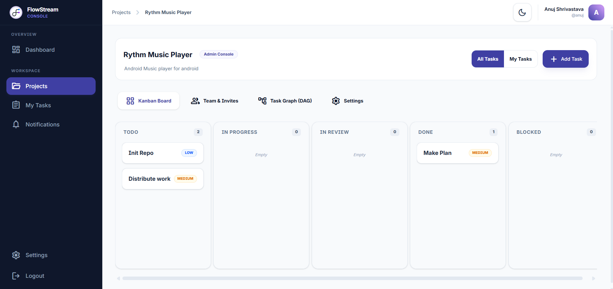
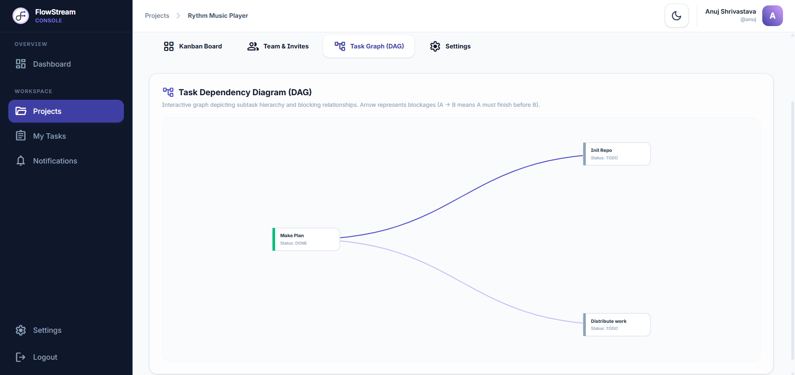

<p>
  
</p>

# FlowStream

FlowStream is an enterprise-grade, low-latency collaborative project orchestration platform. Built on a contract-first architecture using Protocol Buffers and ConnectRPC, it offers robust role-based access controls, nested task hierarchies, and real-time task dependency visualization (Directed Acyclic Graphs).


## Architecture Overview

FlowStream is structured as a pnpm monorepo consisting of decoupled frontend, backend, and API contract services. The architecture emphasizes strict type safety, modular design, and efficient communication protocols.



* **Frontend (`/frontend`):** A responsive web interface built on Svelte 5, SvelteKit, and Tailwind CSS. State management is driven by Svelte 5 runes, ensuring granular and reactive DOM updates.
* **Backend (`/backend`):** A stateless API server using Express and ConnectRPC. It handles authentication, authorization, business rules, and graph operations.
* **Contracts (`/contract`):** Source-of-truth Protocol Buffer definitions (`.proto`) that specify API service interfaces and data models. It compiles into type-safe code shared by the frontend and backend.
* **Database Layer:** PostgreSQL managed via Prisma ORM for schema modeling, migration tracking, and relational queries.

---

## Technical Stack

### Frontend
* Svelte 5 and SvelteKit
* Tailwind CSS
* TypeScript
* Carta Markdown Editor
* Protobuf-es and ConnectRPC Web Transport

### Backend
* Node.js and Express
* TypeScript
* ConnectRPC Node Transport
* Prisma ORM
* PostgreSQL
* JSON Web Token (JWT) Security

### Infrastructure
* pnpm Workspaces
* Docker and Docker Compose
* Nginx Reverse Proxy

---

## Core Features

### Role-Based Access Control (RBAC)
Granular, resource-level access control enforced via server-side middleware. Users occupy roles (Admin, Member) that determine editing, deletion, and project settings privileges.

### Stateless Session Management
Authentication utilizes secure, stateless JSON Web Tokens (JWT) stored in server-set `HttpOnly`, `Secure`, and `SameSite=Strict` cookies to mitigate Cross-Site Scripting (XSS) and Cross-Site Request Forgery (CSRF) vectors.

### Task Management Board
An interactive Kanban board supporting status changes (Backlog, Todo, In Progress, In Review, Done, Blocked, Rejected) and task prioritization (Low, Medium, High, Urgent).

### Nested Subtasks
Support for hierarchical tasks through parent-child relationships, allowing large features to be broken down into structured subtasks.

### Task Dependency Management (DAG)
Directed Acyclic Graph (DAG) structures manage blocking relationships between tasks. The backend validates mutations to prevent circular dependencies.

---

## Local Setup and Development

### Prerequisites
* Node.js (v20+)
* pnpm (v9+)
* Docker and Docker Compose

### Environment Configuration
Copy the default environment template and fill in the required database and server variables:
```bash
cp .env-example .env
```

### Starting the Local Services
Run the development environment using Docker Compose. This starts PostgreSQL, the backend API server, the SvelteKit application, and an Nginx reverse proxy:
```bash
pnpm docker-dev
```

Once initialized:
* Frontend application: `http://localhost:5173`
* Backend API endpoint: `http://localhost:3000`

### Utility Commands
Generate TypeScript code from Protobuf contracts:
```bash
pnpm proto-gen
```

---

## Interface Screenshots

<p align="center">
  
</p>

<p align="center">
  
</p>


<p align="center">
  
</p>
